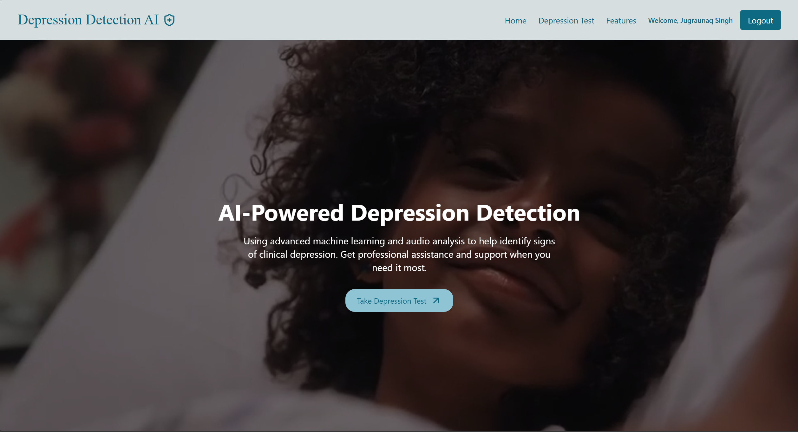
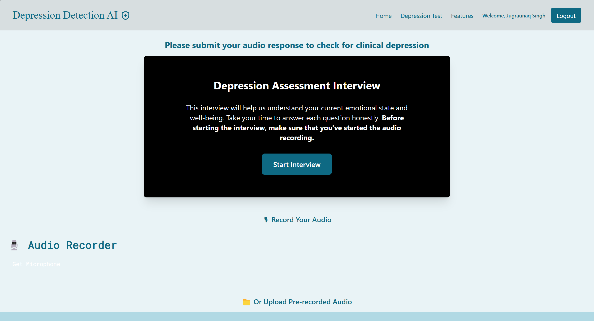
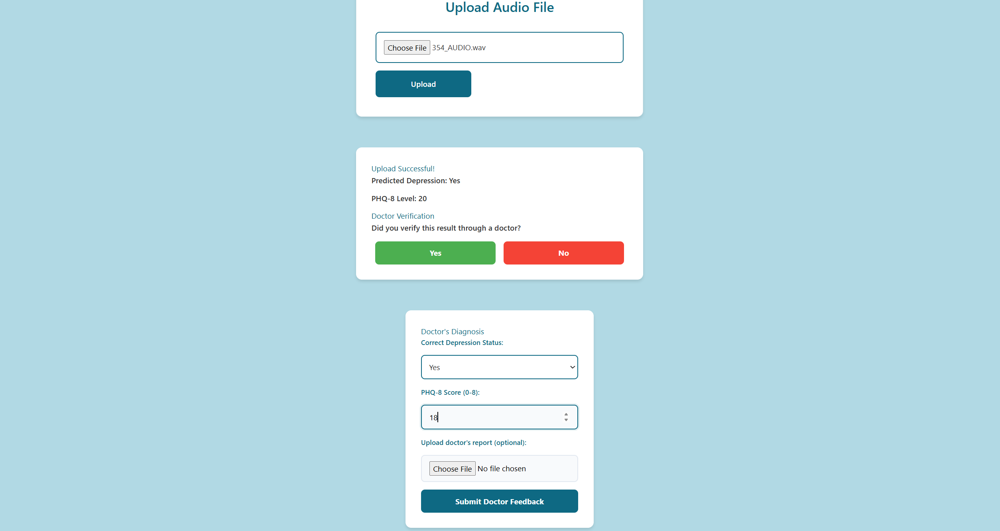

# 🧠 MFCC-Based Clinical Depression Detection via Speech By Jugraunaq Singh

> A deep learning–powered system for automatic detection of depression using speech signals, built with MFCC feature extraction, LSTM models, and FastAPI + React frontend.


---

## 📜 Abstract

This system aims to **detect clinical depression** through acoustic cues in speech using enhanced MFCC features and deep neural networks. It provides a **reliable, real-time, and GPU-accelerated diagnosis** with doctor feedback integration and support for retraining.

---

## WebPage Design



---

## Self Checkup 



---

## 🧠 Sample Prediction Result


---

## 📌 Features

- 🎙️ Audio recording or upload support
- ⚙️ MFCC + harmonic spectrum-based preprocessing
- 🧠 LSTM-based dual-output deep learning model
- 🩺 Doctor feedback loop with retraining capability
- 🧪 Real-time FastAPI backend with React frontend
- 🐳 Fully containerized with Docker (CUDA & cuDNN)
- 🔒 User authentication system (JWT + MongoDB)

---

## 🧱 System Architecture

```
Frontend (React) → FastAPI Backend → MFCC Preprocessing → LSTM Model → Depression Prediction
                                      ↑
                                MongoDB (Auth + Feedback)
```

---

## 📁 Directory Structure

```
├── client/                       # React Frontend
│   └── components/              # AudioUpload, AudioRecorder, Login
├── server/
│   ├── main.py                  # FastAPI app (inference + feedback)
│   ├── auth_routes.py           # Login/Register APIs
│   ├── optimized_preprocess.py  # MFCC & FFT logic
│   ├── model.json / mod.h5      # Trained LSTM model
│   └── db_feedback.py           # MongoDB feedback storage
├── uploads/                     # Uploaded audio files
├── mfccs/                       # Saved MFCC .npy features
├── Dockerfile                   # CUDA-enabled image
├── requirements.txt
└── README.md
```

---

## 🧠 Model Architecture

- **Multi-layer LSTM network** for sequential pattern learning
- Dual outputs:
  - **Binary classification**: Depression / No Depression
  - **Multiclass**: PHQ-8 Severity Score (0–8)
- Preprocessing includes:
  - MFCC (60 coefficients), FFT, Harmonic Emphasis
  - Windowing (2.5s, 0.5s step), CuPy-parallel GPU acceleration

---

## 🩺 Doctor Feedback Loop

After prediction, doctors can:

- ✅ Confirm or correct the prediction
- 🧾 Submit PHQ-8 score
- 📎 Upload clinical reports (PDF/image)
- 📦 All feedback saved to MongoDB and used for retraining

---

## 🚀 Running with Docker

Make sure your `.env` includes:
```env
MONGODB_URI=mongodb+srv://...       # Auth DB
MONGO_URI=mongodb+srv://...         # Feedback DB
JWT_SECRET=your-super-secret-key
```

Then build & run:
```bash
# Build image
docker build -t depression-fastapi-backend .

# Run container
docker run --gpus all --env-file .env ^
  -p 8000:8000 ^
  -v "%cd%\server\uploads:/app/uploads" ^
  -v "%cd%\server\mfccs:/app/mfccs" ^
  -v "%cd%\server\weights:/app/weights" ^
  depression-fastapi-backend
```

---

## 📊 Evaluation Metrics

- **Binary Metrics**: Accuracy, Recall (Sensitivity), Specificity, F1-score
- **Multiclass Metrics**: Precision/Recall per severity level, Confusion Matrix
- **Regression**: RMSE, MAE for PHQ score estimation

---

## 🏆 Results

- ⚡ Real-time inference with GPU support
- 🔁 Retraining enabled through verified feedback
- 🔍 High F1-score on DAIC-WOZ audio samples
- 🧑‍⚕️ Feedback loop improved model adaptability in student scenarios

---

## 👥 Team

**VIT B.Tech (Machine Learning – B2)**
- Arhaan Khan (22BBS0053)  
- Jugraunaq Singh (22BBS0013)  
- Riya Singh (22BBS0130)  

**Faculty Guide**: Dr. Aarthy S. L

---

## 📬 Future Improvements

- 📈 Feedback-based auto-retraining (A/B tested)
- 🌍 Multilingual sentiment support
- 📱 Mobile interface and WhatsApp bot integration
- 👨‍⚕️ Admin dashboard for doctors with analytics

---

## 📌 License

MIT License (Feel free to use and extend)

---

> 🤝 Made with passion at VIT Vellore for real-world impact on student mental health.


This project a MFCC-based Recurrent Neural Network for automatic clinical depression recognition 
and assessment from speech model deployed as a Web Application. The model is a based on one of the proposed solutions of the paper
[Rejaibi, Emna, Komaty, Ali, Meriaudeau, Fabrice, & Othmani, Morgan-Hiring. (2022). MFCC-based Recurrent Neural Network for Automatic Clinical Depression Recognition and Assessment from Speech. Biomedical Signal Processing and Control, 71, 103107. doi: 10.1016/j.bspc.2021.103107.](https://www.researchgate.net/publication/354324031_MFCC-based_Recurrent_Neural_Network_for_automatic_clinical_depression_recognition_and_assessment_from_speech/citations)

The pre processing function and the model itself is slightly altered . The Dataset used is the [DIAC-WOZ](https://dcapswoz.ict.usc.edu/) dataset
